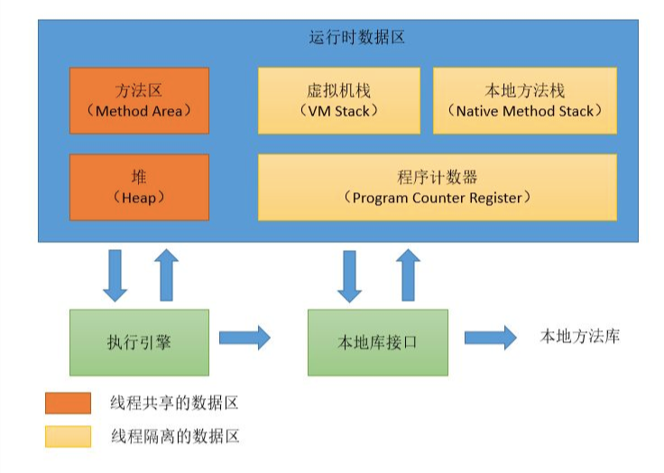

## 笔记

（线程独有）程序计数器：保存当前程序的执行位置。

（线程独有）虚拟机栈：通过栈帧来维持方法调用顺序，帮助控制程序有序运行。

（线程独有）本地方法栈：同上，作用与本地方法。

堆：所有的对象和数组都在这里保存。

方法区：类信息、即时编译器的代码缓存、运行时常量池。




1.7之前指向的是方法区中同一个地址,1.8之后指向的是堆中同一个地址


-Xms1M -Xmx1M -XX:+HeapDumpOnOutOfMemoryError


java_pid66250.hprof 堆转储文件

## 反射相关复习

```java
public static void main(String[] args) throws IllegalAccessException {
    Field unsafeField = Unsafe.class.getDeclaredFields()[0];
    unsafeField.setAccessible(true);
    Unsafe unsafe = (Unsafe) unsafeField.get(null);
}
```

你这段代码是 Java 反射中**获取并使用 Unsafe 类**的经典片段，核心是突破 Java 访问权限限制拿到 Unsafe 实例。我会逐行拆解，让你清楚每一步的作用和背后的原理。

### 代码整体功能总结
这三行代码通过反射绕过 Java 的访问控制，强行获取 `sun.misc.Unsafe` 类的实例——这个类是 Java 中能直接操作内存、调用底层方法的“危险工具”，本身被设计为仅能由 JDK 内部使用，外部无法直接实例化。

### 逐行详细解释

#### 第一行：`Field unsafeField = Unsafe.class.getDeclaredFields()[0];`
```java
Field unsafeField = Unsafe.class.getDeclaredFields()[0];
```
- **核心作用**：获取 `Unsafe` 类中声明的**第一个成员变量**，并封装成 `Field` 对象。
- 关键知识点拆解：
    1. `Unsafe.class`：通过类字面量获取 `Unsafe` 类的 `Class` 对象（反射的入口，所有反射操作都基于 `Class` 对象）。
    2. `getDeclaredFields()`：获取该类**所有声明过的成员变量**（包括 `private`/`protected`/`public`，但不包括父类继承的），返回 `Field[]` 数组。
    3. `[0]`：取数组第一个元素——因为 `Unsafe` 类的源码中，唯一的实例是一个 `private static final Unsafe theUnsafe` 变量，且是该类第一个声明的字段，所以通过下标 0 能拿到它。
- 注意：这行代码有个小风险——如果 JDK 版本变更导致 `Unsafe` 类的字段顺序变化，`[0]` 可能取不到正确的字段（更严谨的写法是通过字段名 `getDeclaredField("theUnsafe")`）。

#### 第二行：`unsafeField.setAccessible(true);`
```java
unsafeField.setAccessible(true);
```
- **核心作用**：关闭 Java 访问权限检查，允许通过反射访问这个 `private` 修饰的字段。
- 关键知识点：
    1. `Field` 类的 `setAccessible(boolean)` 是反射突破访问权限的核心方法——默认情况下，`private` 字段不允许外部访问，调用 `setAccessible(true)` 后，JVM 会跳过访问修饰符的检查。
    2. 这是反射“打破封装”的关键一步，也是 Unsafe 能被外部获取的核心原因。

#### 第三行：`Unsafe unsafe = (Unsafe) unsafeField.get(null);`
```java
Unsafe unsafe = (Unsafe) unsafeField.get(null);
```
- **核心作用**：获取该字段的值，并强转为 `Unsafe` 类型，拿到实例。
- 关键知识点拆解：
    1. `Field.get(Object obj)`：获取指定对象 `obj` 上该字段的值。
    2. 传 `null` 的原因：因为我们要获取的 `theUnsafe` 是 **static 静态字段**——静态字段属于类本身，而非类的实例，所以用 `null` 代替实例对象即可。
    3. 强转 `(Unsafe)`：因为 `get()` 方法返回值是 `Object` 类型，需要强转为具体的 `Unsafe` 类型。

### 补充说明（帮你理解更透彻）
1. 为什么要这么做？  
   `Unsafe` 类的构造方法是 `private`，且没有公开的创建实例的方法（JDK 设计为仅内部使用），所以只能通过反射获取其静态的 `theUnsafe` 实例。
2. 更严谨的写法（避免字段下标问题）：  
   你原代码用 `[0]` 依赖字段顺序，更稳定的写法是通过字段名获取：
   ```java
   Field unsafeField = Unsafe.class.getDeclaredField("theUnsafe"); // 直接指定字段名
   unsafeField.setAccessible(true);
   Unsafe unsafe = (Unsafe) unsafeField.get(null);
   ```

### 总结
1. 第一行：通过反射获取 `Unsafe` 类中名为 `theUnsafe` 的静态字段（靠下标 `[0]`）；
2. 第二行：关闭访问权限检查，允许操作这个 `private` 字段；
3. 第三行：获取静态字段的值（传 `null`），强转后拿到 `Unsafe` 实例。

核心逻辑是：利用反射突破 `private` 访问限制，获取 JDK 隐藏的 `Unsafe` 类实例。


你现在想深入理解 `Field` 类，这是 Java 反射中操作类成员变量的核心工具，我会从基础到应用，用通俗易懂的方式帮你讲清楚。

### 核心定义
`Field` 是 `java.lang.reflect` 包下的类，它的核心作用是：**封装 Java 类中一个成员变量（字段）的所有信息，并提供对这个字段的读写操作能力**。

简单来说，一个 `Field` 对象就代表类里的一个具体字段（比如 `private String name`、`public static int age`），通过它你可以：
- 查看字段的修饰符（`public`/`private`/`static`/`final` 等）、类型、名称；
- 突破访问权限限制，读写任意对象的该字段值（哪怕是 `private` 字段）。

### 关键特性 & 常用方法
先结合你之前的 Unsafe 代码，再扩展核心方法，帮你对应理解：

| 方法 | 作用 | 对应你代码中的使用 |
|------|------|--------------------|
| `setAccessible(true)` | 关闭访问权限检查，允许操作 `private`/`protected` 字段 | 你代码中用来操作 `Unsafe` 的 `private static final theUnsafe` 字段 |
| `get(Object obj)` | 获取 `obj` 对象上该字段的值；如果是静态字段，`obj` 传 `null` | 你代码中 `unsafeField.get(null)` 就是获取静态字段的值 |
| `set(Object obj, Object value)` | 给 `obj` 对象的该字段设置 `value`；静态字段 `obj` 传 `null` | 比如 `field.set(user, "张三")` 给 user 对象的 name 字段赋值 |
| `getName()` | 获取字段的名称（字符串） | `unsafeField.getName()` 会返回 "theUnsafe" |
| `getType()` | 获取字段的类型（返回 `Class` 对象） | `unsafeField.getType()` 会返回 `Unsafe.class` |
| `getModifiers()` | 获取字段的修饰符（返回 int，需配合 `Modifier` 类解析） | 可判断字段是否是 `static`/`final`/`private` 等 |

### 实战示例（帮你理解）
用一个简单的类演示 `Field` 的核心用法，比单纯讲概念更易理解：

```java
import java.lang.reflect.Field;
import java.lang.reflect.Modifier;

// 定义一个普通类
class User {
    // 不同修饰符的字段
    private String name;
    public static int age;

    public User(String name) {
        this.name = name;
    }
}

public class FieldDemo {
    public static void main(String[] args) throws NoSuchFieldException, IllegalAccessException {
        // 1. 获取 Class 对象（反射入口）
        Class<User> userClass = User.class;

        // 2. 获取指定字段（private 字段）
        Field nameField = userClass.getDeclaredField("name");
        // 3. 突破访问限制
        nameField.setAccessible(true);

        // 4. 创建对象实例
        User user = new User("原始名称");
        // 5. 读取字段值
        String nameValue = (String) nameField.get(user);
        System.out.println("读取 private 字段：" + nameValue); // 输出：原始名称

        // 6. 修改字段值
        nameField.set(user, "修改后的名称");
        System.out.println("修改后的值：" + nameField.get(user)); // 输出：修改后的名称

        // ---------------------- 操作静态字段 ----------------------
        // 获取静态字段
        Field ageField = userClass.getDeclaredField("age");
        // 静态字段无需 setAccessible（public），直接操作
        // 读取静态字段：obj 传 null
        System.out.println("静态字段初始值：" + ageField.get(null)); // 输出：0
        // 修改静态字段
        ageField.set(null, 20);
        System.out.println("静态字段修改后：" + ageField.get(null)); // 输出：20

        // ---------------------- 查看字段信息 ----------------------
        // 获取字段修饰符（解析 int 类型的修饰符）
        int modifiers = nameField.getModifiers();
        System.out.println("name 字段是否是 private：" + Modifier.isPrivate(modifiers)); // true
        System.out.println("name 字段的类型：" + nameField.getType().getName()); // java.lang.String
    }
}
```

### 关键注意点（避坑）
1. **getDeclaredField vs getField**：
    - `getDeclaredField("字段名")`：获取类自身声明的所有字段（包括 private/protected/public），但不包括父类的；
    - `getField("字段名")`：只能获取类的 **public 字段**（包括父类继承的 public 字段）。
      你之前的 `Unsafe.class.getDeclaredFields()[0]` 用的是 `getDeclaredFields()`（复数），返回所有声明的字段数组。

2. **静态字段 vs 实例字段**：
    - 实例字段（非 static）：操作时必须传具体的对象实例（比如 `nameField.get(user)`）；
    - 静态字段（static）：操作时传 `null` 即可（比如 `ageField.get(null)`），因为静态字段属于类，而非对象。

3. **异常处理**：
   操作 `Field` 时常见异常：
    - `NoSuchFieldException`：找不到指定名称的字段；
    - `IllegalAccessException`：没调用 `setAccessible(true)` 就操作 private 字段；
    - `NullPointerException`：操作实例字段时传了 `null`。

### 总结
1. `Field` 是反射中**操作类成员变量**的核心类，一个 `Field` 对象对应类的一个具体字段；
2. 核心能力是：突破访问权限（`setAccessible(true)`）、读写字段值（`get()`/`set()`）、查看字段元信息（名称、类型、修饰符）；
3. 区分 `getDeclaredField`（自身所有字段）和 `getField`（仅 public 字段），以及静态/实例字段的操作差异。

简单记：`Field` 就是反射给你的“字段操作工具”，能让你在运行时动态操作类的任意字段，哪怕是私有的。


## JNI 调用本地方法

Java还有一个JNI机制，它的全称：Java Native Interface，即Java本地接口。
它允许在Java虚拟机内运行的Java代码与其他编程语言（如C/C++和汇编语言）编写的程序和库进行交互
（在Android开发中用得比较多）比如我们现在想要让C语言程序帮助我们的Java程序实现a+b的运算

-XX:+PrintGCDetails 

[0.004s][warning][gc] -XX:+PrintGCDetails is deprecated. Will use -Xlog:gc* instead.
[0.016s][info   ][gc,init] CardTable entry size: 512
[0.016s][info   ][gc     ] Using G1
[0.019s][info   ][gc,init] Version: 21.0.10+7-LTS (release)
[0.019s][info   ][gc,init] CPUs: 4 total, 4 available
[0.019s][info   ][gc,init] Memory: 16384M
[0.019s][info   ][gc,init] Large Page Support: Disabled
[0.019s][info   ][gc,init] NUMA Support: Disabled
[0.019s][info   ][gc,init] Compressed Oops: Enabled (Zero based)
[0.019s][info   ][gc,init] Heap Region Size: 2M
[0.019s][info   ][gc,init] Heap Min Capacity: 8M
[0.019s][info   ][gc,init] Heap Initial Capacity: 256M
[0.019s][info   ][gc,init] Heap Max Capacity: 4G
[0.019s][info   ][gc,init] Pre-touch: Disabled
[0.019s][info   ][gc,init] Parallel Workers: 4
[0.019s][info   ][gc,init] Concurrent Workers: 1
[0.019s][info   ][gc,init] Concurrent Refinement Workers: 4
[0.019s][info   ][gc,init] Periodic GC: Disabled
[0.033s][info   ][gc,metaspace] CDS archive(s) mapped at: [0x0000000195000000-0x0000000195cf7000-0x0000000195cf7000), size 13594624, SharedBaseAddress: 0x0000000195000000, ArchiveRelocationMode: 1.
[0.033s][info   ][gc,metaspace] Compressed class space mapped at: 0x0000000196000000-0x00000001d6000000, reserved size: 1073741824
[0.033s][info   ][gc,metaspace] Narrow klass base: 0x0000000195000000, Narrow klass shift: 0, Narrow klass range: 0x100000000
123123
[0.400s][info   ][gc,heap,exit] Heap
[0.401s][info   ][gc,heap,exit]  garbage-first heap   total 264192K, used 3853K [0x0000000700000000, 0x0000000800000000)
[0.402s][info   ][gc,heap,exit]   region size 2048K, 2 young (4096K), 0 survivors (0K)
[0.402s][info   ][gc,heap,exit]  Metaspace       used 768K, committed 896K, reserved 1114112K
[0.402s][info   ][gc,heap,exit]   class space    used 64K, committed 128K, reserved 1048576K


## git 大文件 解决方案 

git filter-repo --invert-paths --path-match java_pid66250.hprof --force 


scavenge /ˈskævɪndʒ/
本义：（动物）捡食腐肉；（人）捡垃圾、搜寻可用之物
引申：清理废物、回收可用资源


## Runnable

```java
public class Main {
    private static int i = 0;
    public static void main(String[] args) throws InterruptedException {
        Lock testLock = new ReentrantLock();   //可重入锁ReentrantLock类是Lock类的一个实现，我们后面会进行介绍
        Runnable action = () -> {
            for (int j = 0; j < 100000; j++) {   //还是以自增操作为例
                testLock.lock();    //加锁，加锁成功后其他线程如果也要获取锁，会阻塞，等待当前线程释放
                i++;
                testLock.unlock();  //解锁，释放锁之后其他线程就可以获取这把锁了（注意在这之前一定得加锁，不然报错）
            }
        };
        new Thread(action).start();
        new Thread(action).start();
        Thread.sleep(1000);   //等上面两个线程跑完
        System.out.println(i);
    }
}
```
你这段代码里的 `Runnable` 是 Java 中实现多线程的核心接口，这里用了 Lambda 表达式简化写法，我会从「是什么、怎么用、代码里的具体作用」三个层面帮你讲清楚，让你彻底理解这段代码中的 `Runnable` 逻辑。

### 先总结核心作用
代码中的 `Runnable` 本质是一个**任务载体**：它封装了“循环10万次对静态变量 `i` 进行加锁自增”的逻辑，两个线程会各自执行这个任务，最终实现多线程下的安全自增。

---

### 1. Runnable 接口的基础认知
`Runnable` 是 `java.lang` 包下的核心函数式接口，专门用来定义**线程要执行的任务**，核心特点：
- 接口中只有一个抽象方法：`void run()`（无返回值、不抛检查异常）；
- 本身不是线程，只是“待执行的任务”，需要交给 `Thread` 来执行；
- Java 8 后因为是函数式接口，可直接用 Lambda 表达式简化编写（代码里就是这种写法）。

#### 传统写法 vs 代码中的 Lambda 写法（对比更易理解）
你代码里用的是 Lambda 简化版，等价于下面的传统匿名内部类写法，能更直观看到 `Runnable` 的结构：
```java
// 传统匿名内部类写法（和代码中的Lambda完全等价）
Runnable action = new Runnable() {
    @Override
    public void run() {
        for (int j = 0; j < 100000; j++) {
            testLock.lock();
            i++;
            testLock.unlock();
        }
    }
};
```
代码中 `() -> { ... }` 就是 Lambda 对 `Runnable` 的简写：
- `()`：对应 `run()` 方法的空参数列表；
- `->`：Lambda 语法分隔符，左边是参数，右边是方法体；
- `{ ... }`：就是 `run()` 方法的具体执行逻辑。

### 2. 这段代码中 Runnable 的具体执行流程
#### 第一步：定义任务
```java
Runnable action = () -> {
    for (int j = 0; j < 100000; j++) {   
        testLock.lock();    // 加锁，保证同一时间只有一个线程执行i++
        i++;
        testLock.unlock();  // 解锁，释放锁给其他线程
    }
};
```
- 这个 `action` 对象封装了“10万次加锁自增 `i`”的任务逻辑；
- 核心目的：通过 `ReentrantLock` 的加锁/解锁，保证 `i++` 这个非原子操作在多线程下的线程安全。

#### 第二步：将任务交给线程执行
```java
new Thread(action).start();
new Thread(action).start();
```
- `new Thread(action)`：创建线程对象，把 `Runnable` 任务传给线程；
- `start()`：启动线程——JVM 会调用该线程的 `run()` 方法（也就是 `Runnable` 里的逻辑）；
- 这里创建了两个线程，**各自独立执行 `action` 里的 10万次循环**（不是共享循环次数，而是每个线程都跑10万次）。

#### 第三步：线程执行的关键细节
- 两个线程会并发执行，但因为 `testLock.lock()` 的存在，同一时间只有一个线程能进入 `i++` 的执行环节；
- 最终 `i` 的结果理论上是 200000（10万+10万），如果不加锁，结果会小于200000（因为 `i++` 是“读取-修改-写入”三步操作，多线程会出现数据覆盖）。

### 3. 关键注意点（避坑）
1. **Runnable 不是线程**：`action` 只是任务，必须通过 `new Thread(action).start()` 才能启动线程执行；如果直接调用 `action.run()`，不会创建新线程，只是在当前主线程执行逻辑。
2. **锁的作用域**：代码中锁包裹了 `i++`，刚好覆盖非原子操作，是正确的；如果锁加在循环外面（比如 `lock()` 在循环前，`unlock()` 在循环后），会导致一个线程独占锁跑完10万次，另一个线程才执行，失去并发意义。
3. **异常处理**：`Runnable` 的 `run()` 不能抛检查异常（比如 `InterruptedException`），如果任务里有需要捕获的异常，必须在 Lambda 内部用 `try-catch` 处理（代码中 `i++` 无异常，所以没写）。

### 总结
1. 代码中的 `Runnable` 是一个**线程任务载体**，用 Lambda 简化写法封装了“10万次加锁自增 `i`”的逻辑；
2. 两个线程分别执行这个 `Runnable` 任务，通过 `ReentrantLock` 保证 `i++` 的线程安全；
3. `Runnable` 的核心价值是**解耦“任务逻辑”和“线程执行”**，让任务可以复用、线程只负责执行。

简单记：`Runnable` 就是“线程要做的事”，你定义好“事”（Lambda 里的逻辑），交给 Thread 去“做”（start()），多线程就跑起来了。


## 介绍一下 condition


你想了解的 `Condition` 是 Java JUC 包中与显式锁（`Lock`）配合使用的**线程等待/通知机制**，可以理解为 `synchronized` 
搭配 `wait()`/`notify()` 的“升级版”，
我会从「是什么、怎么用、核心优势、实战例子」四个维度帮你讲清楚，结合你之前学的 `ReentrantLock` 更容易理解。

### 先明确核心定义
`Condition`（条件对象）是 `java.util.concurrent.locks` 包下的接口，
必须通过 `Lock` 对象的 `newCondition()` 方法创建，
核心作用是：**让线程在满足特定条件时等待，当条件满足时被唤醒**。

简单类比：
- `synchronized` + `wait()`/`notify()` = 老式的“单条件等待通知”；
- `Lock` + `Condition` = 新式的“多条件精准等待通知”。

### 1. Condition 核心方法（对比 wait/notify 更易理解）
| Condition 方法       | 对应 Object 方法 | 作用说明                                                                 |
|----------------------|------------------|--------------------------------------------------------------------------|
| `await()`            | `wait()`         | 让当前线程等待，释放锁，直到被唤醒或中断                                 |
| `await(long time, TimeUnit unit)` | `wait(long timeout)` | 限时等待，超时自动唤醒                                                   |
| `signal()`           | `notify()`       | 唤醒一个等待在该 Condition 上的线程                                       |
| `signalAll()`        | `notifyAll()`    | 唤醒所有等待在该 Condition 上的线程                                       |

⚠️ 关键注意：
和 `wait()`/`notify()` 一样，调用 `Condition` 的方法前，必须先获取对应的 `Lock` 锁（否则会抛 `IllegalMonitorStateException`）。

### 2. Condition 的核心优势（对比 synchronized + wait/notify）
这是 `Condition` 最核心的价值，也是为什么要引入它：
#### 优势1：支持多条件精准唤醒（最核心）
`synchronized` 只有一个“等待集”，`notify()` 只能随机唤醒一个线程，`notifyAll()` 会唤醒所有线程（无关线程也会被唤醒，造成“惊群效应”）；
`Condition` 可以为一个 `Lock` 创建多个条件对象，实现“按需唤醒”——只有满足特定条件的线程才会被唤醒，避免无效竞争。

#### 优势2：更灵活的等待机制
- 支持限时等待（带时间单位，比 `wait(long)` 更直观）；
- 支持可中断等待（`await()` 响应线程中断，抛出 `InterruptedException`）；
- 还提供 `awaitUninterruptibly()`（不响应中断的等待）、`awaitUntil(Date deadline)`（截止时间等待）等高级方法。

### 3. 实战例子（生产者-消费者模型，体现多条件优势）
用 `ReentrantLock + Condition` 实现经典的生产者-消费者，对比 `synchronized` 能直观看到“精准唤醒”的价值：
```java
import java.util.LinkedList;
import java.util.concurrent.locks.Condition;
import java.util.concurrent.locks.Lock;
import java.util.concurrent.locks.ReentrantLock;

// 生产者-消费者容器
class Buffer {
    private final LinkedList<String> queue = new LinkedList<>();
    private final int MAX_CAPACITY = 5; // 队列最大容量
    private final Lock lock = new ReentrantLock();
    // 两个Condition：空条件（队列空时消费者等待）、满条件（队列满时生产者等待）
    private final Condition emptyCondition = lock.newCondition();
    private final Condition fullCondition = lock.newCondition();

    // 生产方法
    public void produce(String item) throws InterruptedException {
        lock.lock(); // 先获取锁
        try {
            // 队列满时，生产者等待（直到队列有空位）
            while (queue.size() == MAX_CAPACITY) {
                fullCondition.await(); // 生产者在fullCondition上等待
            }
            queue.add(item);
            System.out.println("生产：" + item + "，队列大小：" + queue.size());
            emptyCondition.signal(); // 唤醒等待的消费者（只有消费者会在emptyCondition上等）
        } finally {
            lock.unlock(); // 必须在finally中解锁，避免异常导致锁无法释放
        }
    }

    // 消费方法
    public String consume() throws InterruptedException {
        lock.lock();
        try {
            // 队列空时，消费者等待（直到有产品）
            while (queue.size() == 0) {
                emptyCondition.await(); // 消费者在emptyCondition上等待
            }
            String item = queue.removeFirst();
            System.out.println("消费：" + item + "，队列大小：" + queue.size());
            fullCondition.signal(); // 唤醒等待的生产者（只有生产者会在fullCondition上等）
            return item;
        } finally {
            lock.unlock();
        }
    }
}

public class ConditionDemo {
    public static void main(String[] args) {
        Buffer buffer = new Buffer();

        // 启动3个生产者线程
        for (int i = 0; i < 3; i++) {
            new Thread(() -> {
                try {
                    for (int j = 0; j < 2; j++) {
                        buffer.produce("产品" + j);
                        Thread.sleep(100);
                    }
                } catch (InterruptedException e) {
                    Thread.currentThread().interrupt();
                }
            }).start();
        }

        // 启动2个消费者线程
        for (int i = 0; i < 2; i++) {
            new Thread(() -> {
                try {
                    for (int j = 0; j < 3; j++) {
                        buffer.consume();
                        Thread.sleep(200);
                    }
                } catch (InterruptedException e) {
                    Thread.currentThread().interrupt();
                }
            }).start();
        }
    }
}
```

#### 代码关键解读：
1. 创建了两个 `Condition`：
    - `emptyCondition`：队列空时，消费者在这个条件上等待；
    - `fullCondition`：队列满时，生产者在这个条件上等待。
2. 精准唤醒：
    - 生产者生产后，只唤醒等待的消费者（`emptyCondition.signal()`），不会唤醒其他生产者；
    - 消费者消费后，只唤醒等待的生产者（`fullCondition.signal()`），不会唤醒其他消费者。
3. 安全保障：
    - 用 `while` 循环检查条件（而非 `if`），避免“虚假唤醒”（线程被唤醒后需重新检查条件）；
    - 解锁操作放在 `finally` 中，确保无论是否抛异常，锁都会释放。

### 4. 核心注意事项
1. **必须先加锁**：调用 `await()`/`signal()` 前，必须先获取 `Lock` 锁，否则抛 `IllegalMonitorStateException`；
2. **避免虚假唤醒**：永远用 `while` 循环检查条件（`while (条件不满足) { await(); }`），而非 `if`；
3. **解锁时机**：解锁操作必须放在 `finally` 块中，防止异常导致锁泄露；
4. **和 Lock 绑定**：一个 `Condition` 只能和创建它的 `Lock` 配合使用，不能跨 Lock 使用。

### 总结
1. `Condition` 是 JUC 中与 `Lock` 配合的条件等待/通知接口，替代 `synchronized` 的 `wait()`/`notify()`；
2. 核心优势是**多条件精准唤醒**，避免惊群效应，提升并发效率；
3. 核心方法：`await()`（等待）、`signal()`（唤醒单个）、`signalAll()`（唤醒全部），使用前必须先获取锁；
4. 典型场景：生产者-消费者、线程池任务等待等需要精准控制线程等待/唤醒的场景。

简单记：`Condition` 就是给 `Lock` 锁配的“精准唤醒开关”，一个锁可以配多个开关，想唤醒哪类线程就开哪个开关。


## ReentrantLock

```java
public static void main(String[] args) throws InterruptedException {
    // 1. 创建一个ReentrantLock实例（只有这一把锁，所有线程竞争的都是这把锁）
    ReentrantLock lock = new ReentrantLock();
    
    // 2. 主线程（main线程）获取这把锁，且后续没有释放！
    lock.lock();
    
    // 3. 创建两个子线程t1、t2，线程的任务就是调用lock.lock()（尝试获取这把锁）
    // 这里用了方法引用：lock::lock 等价于 () -> { lock.lock(); }
    Thread t1 = new Thread(lock::lock), t2 = new Thread(lock::lock);
    
    // 4. 启动两个子线程，它们会立刻尝试获取锁，但此时锁被主线程持有，获取失败
    t1.start();
    t2.start();
    
    // 5. 主线程休眠1秒，确保t1、t2有足够时间尝试获取锁并进入等待队列
    TimeUnit.SECONDS.sleep(1);
    
    // 6. 打印等待队列相关信息
    // 6.1 获取等待该锁释放的线程数量（预期是2，因为t1、t2都在等）
    System.out.println("当前等待锁释放的线程数："+lock.getQueueLength());
    // 6.2 检查t1是否在等待队列中（预期true）
    System.out.println("线程1是否在等待队列中："+lock.hasQueuedThread(t1));
    // 6.3 检查t2是否在等待队列中（预期true）
    System.out.println("线程2是否在等待队列中："+lock.hasQueuedThread(t2));
    // 6.4 检查主线程自己是否在等待队列中（预期false，因为主线程正持有锁，不需要等）
    System.out.println("当前线程是否在等待队列中："+lock.hasQueuedThread(Thread.currentThread()));
}

```

## 公平锁 非公平锁

公平锁：多个线程按照申请锁的顺序去获得锁，线程会直接进入队列去排队，永远都是队列的第一位才能得到锁。
非公平锁：多个线程去获取锁的时候，会直接去尝试获取，获取不到，再去进入等待队列，如果能获取到，就直接获取到锁。


## Runnable的介绍

一、Runnable 的核心作用
Runnable 是 Java 中一个函数式接口（只有一个抽象方法 run()），它的核心作用是封装要在新线程中执行的任务逻辑。
简单来说：
你把需要异步执行的代码写在 Runnable 的 run() 方法里，这个接口就像一个 “任务模板”，只定义 “要做什么”，但不关心 “谁来执行、怎么执行”。
它解耦了 “任务逻辑” 和 “线程本身的生命周期管理”（比如线程启动、暂停、终止），符合面向对象的 “单一职责原则”。


二、Runnable 和 Thread 的关系
Thread 是 Java 中线程的具体实现类，负责管理线程的生命周期（启动、运行、终止等）；Runnable 是任务的抽象，负责定义线程要执行的内容。二者是 “执行者” 和 “任务” 的关系，具体可以拆解为：
1. 本质关系：Thread 依赖 Runnable 提供执行逻辑
   Thread 类本身也实现了 Runnable 接口（public class Thread implements Runnable），它的 run() 方法逻辑如下：


Thread 是线程的 “容器”，Runnable 是线程要执行的 “内容”。


3. 为什么优先用 Runnable？
   避免单继承限制：Java 是单继承，继承 Thread 后就不能继承其他类，而实现 Runnable 还能继承其他类。
   任务复用：一个 Runnable 实例可以交给多个 Thread 执行，比如：
   java
   运行
   Runnable task = new MyTask();
   // 多个线程执行同一个任务
   new Thread(task, "线程1").start();
   new Thread(task, "线程2").start();
   适配线程池：Java 线程池（ExecutorService）只接收 Runnable/Callable 任务，不直接接收 Thread，这是实际开发中最常用的场景。
   总结
Runnable 的核心作用是封装异步执行的任务逻辑，只定义 “要做什么”，是任务的抽象；
   Thread 是线程的具体实现，负责管理线程生命周期，是任务的 “执行者”；
   
**二者的核心关系是：Thread 通过调用 Runnable 的 run() 方法执行任务**
实际开发中优先使用 Runnable（解耦、无单继承限制、适配线程池）。


## 是只有一个抽象方法的情况下才可以简写为 lambda表达式吗？

你问的是 “是不是只有一个抽象方法的接口才能简写为 Lambda 表达式”，这个理解基本正确，但需要补充一些关键细节来让你完全掌握这个知识点。
一、核心结论：Lambda 表达式的核心前提
Lambda 表达式在 Java 中是函数式接口的 “语法糖”（简化写法），而函数式接口的定义就是：只有一个抽象方法的接口（注意是 “抽象方法”，不是所有方法）。
也就是说：
✅ 能简写为 Lambda：只有当接口满足 “函数式接口” 条件（仅一个抽象方法）时，才能用 Lambda 表达式替代该接口的实现类。


## CAS算法

你想让我用通俗易懂的方式介绍 CAS 算法，这是理解 Java 并发编程（比如原子类、锁底层）的核心，我会用生活化的例子把它讲明白，避免复杂术语。

### 一、先讲 CAS 是什么（大白话定义）
CAS 是 **Compare And Swap（比较并交换）** 的缩写，是一种**无锁的并发编程思想**——简单说就是：
> 我想把某个值从 A 改成 B，但改之前要先确认它还是不是 A；如果是，就改成 B；如果不是（说明被别人改过了），就不改了，然后重试/放弃。

### 二、用生活化的例子理解 CAS
假设你有一个存钱罐（变量），里面现在有 100 元（旧值），你想存 50 元，把它改成 150 元（新值）。

#### 普通方式（容易出问题）
你直接打开存钱罐，数了数是 100 元，刚要放 50 元进去，突然被人打断（其他线程），别人偷偷拿走了 20 元，你没发现，还是放了 50 元，最后存钱罐变成 130 元（本该是 100-20+50=130？不，本该是你先确认再改，否则逻辑就错了）。

#### CAS 方式（安全）
你做了 3 步操作，这 3 步是**原子性**的（要么全成，要么全败，中间不会被打断）：
1. **比较（Compare）**：先核对存钱罐当前的钱是不是 100 元（旧值）；
2. **交换（Swap）**：如果是 100 元，就把它改成 150 元（新值）；
3. **结果**：如果不是 100 元（比如被人改成 80 了），就放弃这次修改，告诉你“改失败了”，你可以选择重试（再核对一次）或放弃。

这个过程就像：你改之前先“验个货”，确认没被别人动过，才动手改，保证了修改的安全性。

### 三、CAS 的核心要素（3 个值）
CAS 操作永远只需要 3 个核心参数，对应上面的例子：
| 参数       | 例子中的对应值 | 说明                     |
|------------|----------------|--------------------------|
| 内存值（V）| 存钱罐当前的钱 | 要修改的变量本身         |
| 预期值（A）| 100 元         | 你认为变量现在应该有的值 |
| 更新值（B）| 150 元         | 你想把变量改成的值       |

CAS 的逻辑用伪代码表示就是：
```java
// CAS 操作（原子性）
boolean cas(内存值 V, 预期值 A, 更新值 B) {
    if (V == A) { // 比较：确认内存值和预期值一致
        V = B;    // 交换：把内存值改成新值
        return true; // 修改成功
    }
    return false; // 修改失败（内存值被改过了）
}
```

### 四、CAS 的“重试”逻辑（自旋）
如果 CAS 失败了（V≠A），怎么办？
最常见的做法是**自旋**（循环重试）：比如你第一次核对存钱罐是 80 元（不是预期的 100），改失败了，你就再等一下，重新核对，直到成功或放弃。

举个 Java 里的实际例子（AtomicInteger 就是用 CAS 实现的）：
```java
import java.util.concurrent.atomic.AtomicInteger;

public class CASDemo {
    public static void main(String[] args) {
        AtomicInteger num = new AtomicInteger(100); // 初始值 100（对应存钱罐）
        
        // 尝试把 num 从 100 改成 150（CAS 操作）
        boolean success = num.compareAndSet(100, 150);
        System.out.println("第一次修改：" + (success ? "成功" : "失败")); // 成功
        
        // 再尝试把 num 从 100 改成 200（此时 num 已经是 150 了）
        success = num.compareAndSet(100, 200);
        System.out.println("第二次修改：" + (success ? "成功" : "失败")); // 失败
        
        // 自旋重试（简化版）
        int expect = 150;
        int update = 200;
        while (!num.compareAndSet(expect, update)) {
            // 失败后重新获取当前值作为新的预期值
            expect = num.get();
        }
        System.out.println("自旋后的值：" + num.get()); // 200
    }
}
```

### 五、CAS 的优点 & 缺点（大白话）
#### 优点：无锁，效率高
普通的锁（比如 synchronized）是“独占式”的——你拿到锁，别人就得等；而 CAS 是“无锁”的，大家一起尝试修改，失败了就重试，不用等别人释放锁，在并发量不高时效率更高。

#### 缺点：3 个常见问题
1. **ABA 问题**：比如存钱罐先是 100 元，被人改成 80，又改回 100，你用 CAS 核对是 100，以为没被改过，其实被动过了。（解决：加版本号，比如 100-v1 → 80-v2 → 100-v3，核对时不仅看值，还看版本号）
2. **自旋消耗 CPU**：如果并发量很高，CAS 一直失败，线程就会一直循环重试，耗 CPU。（解决：限制重试次数，或改用锁）
3. **只能修改一个变量**：CAS 只能保证一个变量的原子操作，没法同时改多个变量。（解决：把多个变量封装成一个对象，用 CAS 改对象的引用）

### 六、CAS 在哪里用？
Java 里很多并发工具都是基于 CAS 实现的：
- `java.util.concurrent.atomic` 包下的类（AtomicInteger、AtomicLong 等）；
- 并发集合（比如 ConcurrentHashMap）；
- 锁的底层（比如 ReentrantLock 的非公平锁）。

### 总结
1. CAS 核心是“先比较、后交换”，3 个关键值：内存值、预期值、更新值，且操作是原子性的；
2. 失败后可“自旋重试”，是无锁的并发方案，比传统锁更轻量；
3. 优点是效率高，缺点是有 ABA 问题、自旋耗 CPU、只能改单个变量。

简单记：CAS 就像改东西前先“验货”，货对了才改，货不对就重来，不用占着东西不让别人碰，效率更高。


JUC提供了专用于并发场景下的容器，
比如我们刚刚使用的ArrayList，在多线程环境下是没办法使用的，我们可以将其替换为JUC提供的多线程专用集合类


## CopyOnWriteArrayList

你想了解 Java 中的 `CopyOnWriteArrayList`，这是一个非常实用的并发集合类，我会从基础概念、工作原理、使用场景和注意事项等方面为你详细讲解。

### 一、什么是 CopyOnWriteArrayList
`CopyOnWriteArrayList` 是 Java `java.util.concurrent` 包下的一个线程安全的 List 实现，核心思想是 **“写时复制”（Copy On Write，COW）**：
- 读操作：直接访问原数组，无需加锁，效率极高；
- 写操作（添加、修改、删除）：先复制一份新数组，在新数组上完成修改，再将原数组引用指向新数组，全程加锁保证线程安全。

它解决了普通 ArrayList 线程不安全、Vector 读写均加锁导致效率低的问题，是**读多写少**场景下的最优选择。

### 二、核心工作原理
#### 1. 底层结构
`CopyOnWriteArrayList` 底层维护一个 `volatile` 修饰的数组（保证数组引用的可见性），写操作时的核心步骤：
1. 加锁（ReentrantLock），防止多线程同时写；
2. 复制原数组到新数组（新数组长度根据操作调整，比如添加元素时长度+1）；
3. 在新数组上执行写操作（添加/修改/删除）；
4. 将原数组引用替换为新数组；
5. 解锁。

#### 2. 核心方法示例（添加元素）
```java
import java.util.concurrent.CopyOnWriteArrayList;

public class CopyOnWriteArrayListDemo {
    public static void main(String[] args) {
        // 创建 CopyOnWriteArrayList 实例
        CopyOnWriteArrayList<String> list = new CopyOnWriteArrayList<>();

        // 写操作：添加元素（底层会触发数组复制）
        list.add("Java");
        list.add("Python");
        list.add("Go");

        // 读操作：直接访问原数组，无锁
        System.out.println("遍历结果：");
        for (String s : list) {
            System.out.println(s);
        }

        // 写操作：修改元素（同样触发数组复制）
        list.set(1, "JavaScript");
        System.out.println("\n修改后结果：" + list.get(1)); // 输出：JavaScript

        // 写操作：删除元素（触发数组复制）
        list.remove(2);
        System.out.println("\n删除后长度：" + list.size()); // 输出：2
    }
}
```

#### 3. 关键特性解释
- **线程安全**：写操作加锁，读操作无锁，多线程读不会阻塞，读和写也不会互相阻塞（但写操作之间会阻塞）；
- **弱一致性**：迭代器遍历的是“写操作前的原数组副本”，不会抛出 `ConcurrentModificationException`（并发修改异常），但可能读取到旧数据；
- **内存开销**：写操作会复制整个数组，数据量大时会占用大量内存，频繁写会导致性能下降。

### 三、适用场景 & 不适用场景
#### ✅ 适用场景
- 读操作远多于写操作（如配置缓存、日志收集、黑名单列表）；
- 对数据一致性要求不高（允许读取到旧数据）；
- 不需要实时更新数据的场景。

#### ❌ 不适用场景
- 写操作频繁（如高频添加/修改/删除的业务列表）；
- 对数据实时性要求高（如秒杀库存、金融交易数据）；
- 数据量极大（复制数组会导致 OOM 或严重性能问题）。

### 四、与 ArrayList/Vector 的对比
| 特性                | ArrayList       | Vector          | CopyOnWriteArrayList |
|---------------------|-----------------|-----------------|----------------------|
| 线程安全            | ❌ 不安全       | ✅ 安全（同步锁）| ✅ 安全（写时复制）  |
| 读操作性能          | 高（无锁）      | 低（同步锁）    | 高（无锁）           |
| 写操作性能          | 高（无锁）      | 低（同步锁）    | 低（复制数组+加锁）  |
| 并发修改异常        | ✅ 可能抛出     | ✅ 可能抛出     | ❌ 不会抛出          |
| 内存开销            | 低              | 低              | 高（写时复制）       |

### 总结
1. `CopyOnWriteArrayList` 核心是**写时复制**，读无锁、写加锁+复制数组，保证线程安全且读性能极高；
2. 适合**读多写少、允许弱一致性**的场景，不适合写频繁或数据量大的场景；
3. 相比 Vector，它解决了“读操作也加锁”的性能问题，相比 ArrayList，解决了线程不安全的问题，但代价是写性能和内存开销。


## ThreadPoolExecutor

corePoolSize：核心线程池大小，我们每向线程池提交一个多线程任务时，都会创建一个新的核心线程，无论是否存在其他空闲线程，直到到达核心线程池大小为止，之后会尝试复用线程资源。当然也可以在一开始就全部初始化好，调用 prestartAllCoreThreads()即可。
maximumPoolSize：最大线程池大小，当目前线程池中所有的线程都处于运行状态，并且等待队列已满，那么就会直接尝试继续创建新的非核心线程运行，但是不能超过最大线程池大小。
keepAliveTime：线程最大空闲时间，当一个非核心线程空闲超过一定时间，会自动销毁。
unit：线程最大空闲时间的时间单位
workQueue：线程等待队列，当线程池中核心线程数已满时，就会将任务暂时存到等待队列中，直到有线程资源可用为止，这里可以使用我们上一章学到的阻塞队列。
threadFactory：线程创建工厂，我们可以干涉线程池中线程的创建过程，进行自定义。
handler：拒绝策略，当等待队列和线程池都没有空间了，真的不能再来新的任务时，来了个新的多线程任务，那么只能拒绝了，这时就会根据当前设定的拒绝策略进行处理。


## 流程

创建核心线程 —> 进入等待队列 -> 直接创建新的非核心线程 -> 拒绝


## ScheduledThreadPoolExecutor


##  Future 的用法


### Future 核心概念与用法
`Future` 是 Java 并发包（`java.util.concurrent`）中的接口，它的核心作用是：**代表一个异步计算的结果**。
你可以把它理解为一个「未来的结果凭证」—— 提交异步任务后，不用立刻等待结果，先拿到这个凭证，之后在需要的时候再通过这个凭证获取结果（或取消任务）。

#### 1. Future 核心方法（最常用）
| 方法 | 作用 | 关键说明 |
|------|------|----------|
| `V get()` | 获取异步任务的执行结果 | 阻塞当前线程，直到任务完成并返回结果 |
| `V get(long timeout, TimeUnit unit)` | 带超时的获取结果 | 阻塞指定时间，如果超时还没拿到结果，抛出 `TimeoutException` |
| `boolean isDone()` | 判断任务是否完成 | 任务正常完成/异常/被取消，都返回 `true` |
| `boolean cancel(boolean mayInterruptIfRunning)` | 取消任务 | `mayInterruptIfRunning`：是否中断正在执行的任务 |
| `boolean isCancelled()` | 判断任务是否被取消 | 任务完成前被取消则返回 `true` |

#### 2. ScheduledFuture（你的代码中用到的）
`ScheduledFuture` 是 `Future` 的子类，专门用于**定时/延迟任务**，额外增加了一个核心方法：
- `long getDelay(TimeUnit unit)`：获取任务**剩余**的延迟执行时间（比如你代码中获取剩余毫秒数，再转成秒）

#### 3. Future 完整使用示例（含各种场景）
下面我写一个覆盖 `Future` 核心用法的示例，包含「普通任务」「定时任务」「取消任务」「超时获取」等场景，你可以直接运行测试：

```java
import java.util.concurrent.*;

public class FutureDemo {
    public static void main(String[] args) throws ExecutionException, InterruptedException, TimeoutException {
        // ========== 场景1：普通异步任务（ThreadPoolExecutor + Future） ==========
        ExecutorService executor = Executors.newFixedThreadPool(2);
        
        // 提交异步任务，返回 Future 对象（计算1+2的结果）
        Future<Integer> normalFuture = executor.submit(() -> {
            Thread.sleep(1000); // 模拟任务耗时
            return 1 + 2;
        });
        
        // 任务执行中，先做其他事情
        System.out.println("等待异步任务执行...");
        
        // 方式1：阻塞获取结果（直到任务完成）
        Integer result = normalFuture.get();
        System.out.println("普通任务执行结果：" + result); // 输出 3
        
        // 方式2：带超时的获取结果（避免无限阻塞）
        Future<String> timeoutFuture = executor.submit(() -> {
            Thread.sleep(3000);
            return "超时测试";
        });
        try {
            // 只等待2秒，超时则抛出 TimeoutException
            String timeoutResult = timeoutFuture.get(2, TimeUnit.SECONDS);
            System.out.println("超时任务结果：" + timeoutResult);
        } catch (TimeoutException e) {
            System.out.println("任务超时，取消任务");
            timeoutFuture.cancel(true); // 取消超时的任务
        }

        // ========== 场景2：定时任务（ScheduledThreadPoolExecutor + ScheduledFuture） ==========
        ScheduledThreadPoolExecutor scheduledExecutor = new ScheduledThreadPoolExecutor(2);
        
        // 提交延迟3秒执行的任务，返回 ScheduledFuture
        ScheduledFuture<String> scheduledFuture = scheduledExecutor.schedule(() -> {
            return "定时任务执行完成";
        }, 3, TimeUnit.SECONDS);
        
        // 获取任务剩余延迟时间（你的代码核心逻辑）
        System.out.println("任务剩余等待时间：" + scheduledFuture.getDelay(TimeUnit.MILLISECONDS) / 1000.0 + "s");
        
        // 阻塞获取定时任务结果
        String scheduledResult = scheduledFuture.get();
        System.out.println("定时任务执行结果：" + scheduledResult);

        // ========== 其他常用方法 ==========
        Future<Boolean> cancelFuture = executor.submit(() -> {
            Thread.sleep(5000);
            return true;
        });
        // 判断任务是否完成（此时还在执行，返回 false）
        System.out.println("任务是否完成：" + cancelFuture.isDone());
        // 取消任务（true 表示中断正在执行的任务）
        boolean isCancelled = cancelFuture.cancel(true);
        System.out.println("任务是否取消成功：" + isCancelled);
        System.out.println("任务是否被取消：" + cancelFuture.isCancelled()); // 返回 true

        // 关闭线程池
        executor.shutdown();
        scheduledExecutor.shutdown();
    }
}
```

#### 4. 运行结果（参考）
```
等待异步任务执行...
普通任务执行结果：3
任务超时，取消任务
任务剩余等待时间：2.998s
定时任务执行完成
任务是否完成：false
任务是否取消成功：true
任务是否被取消：true
```

### 5. Future 的实际应用场景
- **异步计算**：比如后台处理大数据计算，主线程不用等待，先处理其他逻辑，需要结果时再 `get()`
- **定时任务**：结合 `ScheduledThreadPoolExecutor` 实现延迟/周期性任务，通过 `getDelay()` 监控任务状态
- **任务管控**：通过 `cancel()` 取消不需要的任务，通过 `isDone()` 判断任务状态，避免无效阻塞
- **超时控制**：通过 `get(timeout, unit)` 防止任务无限阻塞，提升程序健壮性

### 总结
1. **核心作用**：`Future` 是异步任务的「结果凭证」，用于获取异步任务的结果、判断任务状态、取消任务，解决了主线程同步等待的问题。
2. **关键方法**：`get()`（阻塞获取结果）、`get(timeout, unit)`（超时获取）、`cancel()`（取消任务）、`isDone()`（判断完成状态）；`ScheduledFuture` 额外提供 `getDelay()` 用于定时任务的剩余时间查询。
3. **使用场景**：异步计算、定时任务、任务超时控制、非阻塞编程，是 Java 并发编程中处理异步任务的基础工具。

需要注意的是，`Future.get()` 是**阻塞式**的，如果需要非阻塞的回调式处理，可以使用 Java 8 后的 `CompletableFuture`（`Future` 的增强版），如果感兴趣我可以再补充讲解。


##  Executor框架  （它和线程池的关系）

我用「生活场景+通俗语言」的方式给你讲清楚 Executor 框架，以及它和线程池的关系，保证新手也能一听就懂。

### 先搞懂核心关系（一句话）
**Executor 框架是「一套异步任务执行的标准规范/工具包」，线程池是 Executor 框架中最核心、最常用的实现；线程池属于 Executor 框架，但 Executor 框架不止包含线程池。**

### 用生活例子理解 Executor 框架
假设你是一家小公司的老板，需要处理很多「任务」（比如写代码、做报表、谈客户）：
- 原始方式（没有 Executor）：每来一个任务，就招聘一个新员工（new Thread），任务做完员工就离职。缺点：招聘/离职（创建/销毁线程）成本高、员工数量失控、没法管理。
- 用 Executor 框架（有规范）：你制定了「任务处理规则」—— 比如任务怎么分配、谁来执行、执行完怎么反馈结果。
- 线程池（Executor 的核心实现）：你招了一批固定数量的员工（核心线程），成立一个「任务处理部门」（线程池），所有任务都交给这个部门处理：
    - 有任务时，空闲员工直接做；
    - 任务多了，先排队（任务队列）；
    - 队列满了，再临时招点临时工（非核心线程）；
    - 闲下来后，临时工自动离职（线程回收）。

### 拆解 Executor 框架的核心组成（通俗版）
Executor 框架不是一个单独的类，而是 `java.util.concurrent` 包下一套相互配合的接口/类，核心组成分 3 类：

| 角色                | 通俗理解                          | 对应核心接口/类                          |
|---------------------|-----------------------------------|------------------------------------------|
| 任务提交者          | 老板（提交任务的代码）            | 程序员写的业务代码                      |
| 任务执行器（规范）  | 任务处理规则（比如“任务要排队”）  | Executor、ExecutorService 接口           |
| 任务执行器（实现）  | 任务处理部门（真正干活的）        | ThreadPoolExecutor（普通线程池）、ScheduledThreadPoolExecutor（定时线程池） |
| 任务结果            | 员工做完任务后的汇报单            | Future、ScheduledFuture 接口             |

### 一步步理解 Executor 框架的层级（从简单到复杂）
#### 1. 最基础：Executor 接口（只有一个方法）
这是框架的「最顶层规范」，只定义了“怎么提交任务”，不管怎么执行：
```java
// 核心就这一个方法：提交任务（Runnable）
public interface Executor {
    void execute(Runnable command);
}
```
就像你只规定了“任务要交到前台”，但没说谁来做、怎么做。

#### 2. 常用：ExecutorService 接口（Executor 的增强版）
在 Executor 基础上，增加了「线程池管理」「带返回值任务」「关闭线程池」等能力：
- 能提交带返回值的任务（`submit(Callable)`），返回 Future 结果；
- 能关闭线程池（`shutdown()`/`shutdownNow()`）；
- 能判断线程池是否关闭（`isShutdown()`）。

#### 3. 落地实现：线程池类（真正干活的）
ExecutorService 只是“规则”，真正实现这些规则的就是各种线程池类：
- `ThreadPoolExecutor`：最核心的普通线程池（你之前用的 `newFixedThreadPool`/`newCachedThreadPool` 都是它的封装）；
- `ScheduledThreadPoolExecutor`：定时/延迟线程池（你代码里用到的）；
- `Executors`：工具类，提供各种线程池的“快捷创建方式”（比如 `Executors.newFixedThreadPool(5)` 直接创建固定线程数的线程池）。

### 用你熟悉的代码对应 Executor 框架
回到你之前的代码，我们对应一下框架的各个部分：
```java
// 1. 创建线程池（ExecutorService 的实现类）：相当于成立“定时任务处理部门”
ScheduledThreadPoolExecutor executor = new ScheduledThreadPoolExecutor(2);

// 2. 提交任务（ExecutorService 的方法）：把任务交给部门
ScheduledFuture<String> future = executor.schedule(() -> "????", 3, TimeUnit.SECONDS);

// 3. 获取结果（Future 接口）：拿员工的汇报单
System.out.println("任务执行结果："+future.get());

// 4. 关闭线程池（ExecutorService 的方法）：解散部门
executor.shutdown();
```

### 总结
1. **Executor 框架**：是 Java 提供的「异步任务执行的整套解决方案」，定义了“提交任务-执行任务-获取结果”的标准流程，核心是解耦“任务提交”和“任务执行”。
2. **线程池**：是 Executor 框架的「核心落地实现」（比如 ThreadPoolExecutor），相当于框架的“干活的人”，解决了线程创建/销毁成本高、资源失控的问题。
3. **核心价值**：不用自己手动 new Thread 管理线程，只需关注“要做什么任务”，剩下的“谁来做、做多少、怎么做”都交给 Executor 框架（线程池）处理，大大简化并发编程。


## scheduleAtFixedRate 和 scheduleWithFixedDelay 的区别

我用**通俗的生活例子+代码演示+直观对比**的方式，帮你彻底搞懂 `scheduleAtFixedRate` 和 `scheduleWithFixedDelay` 的核心区别——这两个方法都是 `ScheduledThreadPoolExecutor` 用来执行**周期性任务**的，但执行时机的逻辑完全不同。

### 先记住核心结论（一句话）
- `scheduleAtFixedRate`：**固定频率执行** → 以上一次任务「开始执行」的时间为基准，固定间隔触发下一次（不管任务执行多久）。
- `scheduleWithFixedDelay`：**固定延迟执行** → 以上一次任务「执行完成」的时间为基准，固定间隔触发下一次（必须等上一次做完）。

### 用生活例子理解
假设你要定时给花盆浇水，设定“间隔3秒”：
1. **scheduleAtFixedRate（固定频率）**：
    - 第0秒开始第一次浇水（耗时2秒）→ 第3秒（0+3）必须开始第二次浇水（不管第一次是否浇完）；
    - 如果某次浇水耗时5秒（超过3秒间隔），则第二次浇水会在第一次结束后**立刻执行**（补上延迟的时间）。

2. **scheduleWithFixedDelay（固定延迟）**：
    - 第0秒开始第一次浇水（耗时2秒）→ 第2秒完成 → 等3秒 → 第5秒（2+3）开始第二次浇水；
    - 任务执行时间不影响“延迟间隔”，间隔只在任务完成后计算。

### 代码演示（直观对比）
下面写一个可运行的代码，模拟“任务执行耗时2秒，间隔3秒”的场景，你可以直接运行看结果：

```java
import java.util.concurrent.Executors;
import java.util.concurrent.ScheduledExecutorService;
import java.util.concurrent.TimeUnit;

public class ScheduledTaskDemo {
    public static void main(String[] args) throws InterruptedException {
        // 记录程序启动时间（用于计算相对时间）
        long startTime = System.currentTimeMillis();

        // ========== 测试1：scheduleAtFixedRate（固定频率） ==========
        System.out.println("===== 测试 scheduleAtFixedRate =====");
        ScheduledExecutorService executor1 = Executors.newScheduledThreadPool(1);
        // 延迟0秒开始，每隔3秒执行一次（固定频率）
        executor1.scheduleAtFixedRate(() -> {
            long now = System.currentTimeMillis();
            System.out.println("固定频率任务执行 - 相对时间：" + (now - startTime) / 1000.0 + "s");
            try {
                // 模拟任务执行耗时2秒
                Thread.sleep(2000);
            } catch (InterruptedException e) {
                e.printStackTrace();
            }
        }, 0, 3, TimeUnit.SECONDS);

        // 运行10秒后停止测试1
        Thread.sleep(10000);
        executor1.shutdown();

        // 重置启动时间，避免干扰
        startTime = System.currentTimeMillis();
        Thread.sleep(1000); // 间隔1秒，方便看输出

        // ========== 测试2：scheduleWithFixedDelay（固定延迟） ==========
        System.out.println("\n===== 测试 scheduleWithFixedDelay =====");
        ScheduledExecutorService executor2 = Executors.newScheduledThreadPool(1);
        // 延迟0秒开始，每次完成后延迟3秒执行（固定延迟）
        executor2.scheduleWithFixedDelay(() -> {
            long now = System.currentTimeMillis();
            System.out.println("固定延迟任务执行 - 相对时间：" + (now - startTime) / 1000.0 + "s");
            try {
                // 模拟任务执行耗时2秒
                Thread.sleep(2000);
            } catch (InterruptedException e) {
                e.printStackTrace();
            }
        }, 0, 3, TimeUnit.SECONDS);

        // 运行15秒后停止测试2
        Thread.sleep(15000);
        executor2.shutdown();
    }
}
```

### 运行结果分析
#### 1. scheduleAtFixedRate 输出（固定频率）
```
===== 测试 scheduleAtFixedRate =====
固定频率任务执行 - 相对时间：0.0s  // 第0秒开始（耗时2秒，到第2秒结束）
固定频率任务执行 - 相对时间：3.0s  // 第3秒开始（以上一次开始的0秒+3秒）
固定频率任务执行 - 相对时间：6.0s  // 第6秒开始（以上一次开始的3秒+3秒）
固定频率任务执行 - 相对时间：9.0s  // 第9秒开始（以上一次开始的6秒+3秒）
```
👉 规律：任务开始时间是 `0s、3s、6s、9s`，严格按「开始时间+3秒」触发，和任务执行耗时无关。

#### 2. scheduleWithFixedDelay 输出（固定延迟）
```
===== 测试 scheduleWithFixedDelay =====
固定延迟任务执行 - 相对时间：0.0s  // 第0秒开始，2秒后（第2秒）完成
固定延迟任务执行 - 相对时间：5.0s  // 完成后等3秒 → 2+3=5秒开始，7秒完成
固定延迟任务执行 - 相对时间：10.0s // 完成后等3秒 →7+3=10秒开始，12秒完成
固定延迟任务执行 - 相对时间：15.0s // 完成后等3秒 →12+3=15秒开始
```
👉 规律：任务开始时间是 `0s、5s、10s、15s`，严格按「上一次完成时间+3秒」触发。

### 特殊场景：任务执行时间 > 间隔时间
如果把任务耗时改成4秒（超过3秒间隔），再看区别：
- **scheduleAtFixedRate**：上一次任务0秒开始，4秒完成（本应3秒开始下一次）→ 下一次任务会在4秒时**立刻执行**（补上延迟），后续仍按“开始时间+3秒”（4、7、10...）；
- **scheduleWithFixedDelay**：上一次任务0秒开始，4秒完成 → 等3秒 → 7秒开始下一次，不受任务耗时超过间隔的影响。

### 总结
| 特性                | scheduleAtFixedRate（固定频率）| scheduleWithFixedDelay（固定延迟）|
|---------------------|----------------------------------|------------------------------------|
| 时间基准            | 以上一次任务「开始」时间计算间隔 | 以上一次任务「完成」时间计算间隔   |
| 核心逻辑            | 保证“频率”，不管任务执行多久     | 保证“间隔”，必须等上一次做完       |
| 适用场景            | 需严格按固定频率执行的任务（如心跳、定时上报） | 需等上一次任务完成后，再隔一段时间执行（如批量处理、依赖上一次结果的任务） |

简单记：
- 要“每X秒执行一次（不管做多久）” → 用 `scheduleAtFixedRate`；
- 要“做完一次，等X秒再做下一次” → 用 `scheduleWithFixedDelay`。


## CountDownLatch

CountDownLatch的基本实现思路：

利用共享锁实现
在一开始的时候就是已经上了count层锁的状态，也就是state = count
await()就是加共享锁，但是必须state为0才能加锁成功，否则按照AQS的机制，会进入等待队列阻塞，加锁成功后结束阻塞
countDown()就是解1层锁，也就是靠这个方法一点一点把state的值减到0


